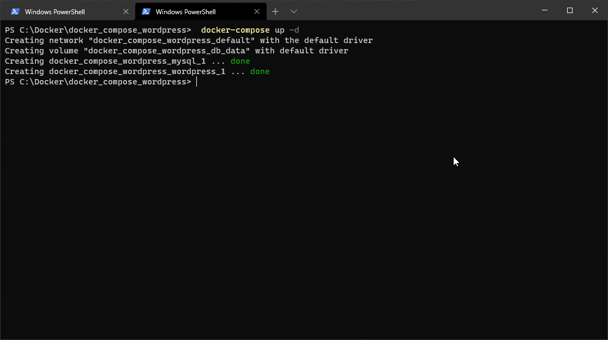
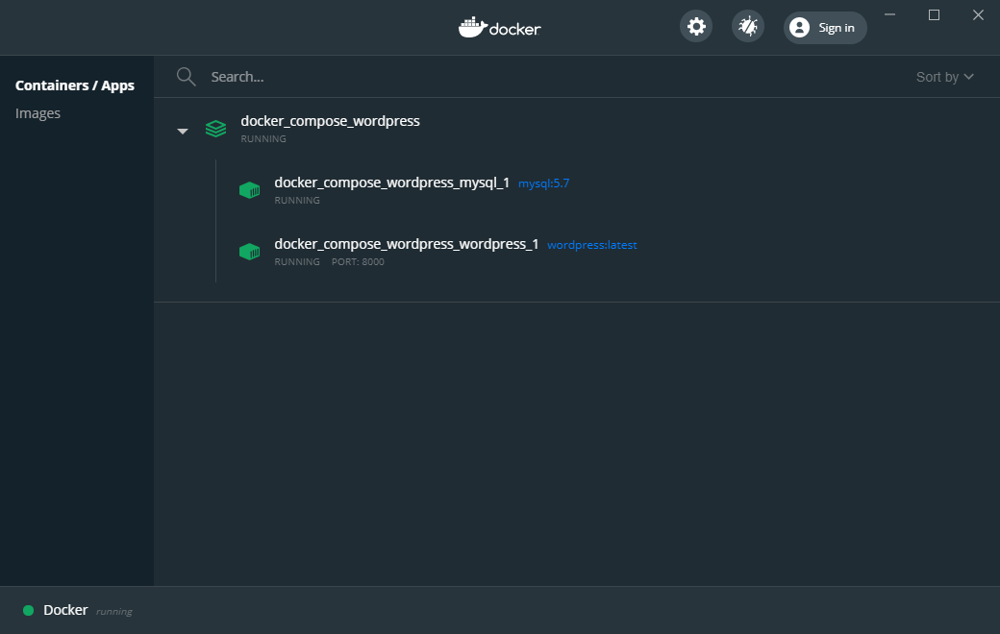

[< BACK ](../../README.md)

## Docker-compose

- [Wordpress with docker-compose.yml](#Wordpress-with-docker_-_compose.yml)
    - [Prepare docker-compose.yml](#Prepare-docker_-_compose.yml)
    - [Add mysql service](#Add-mysql-service)
    - [Add wordpress service](#Add-wordpress-service)
    - [Run the stack](#Run-the-stack)


Docker Compose is a tool that helps orchestration of structures composed of multiple containers.
When writing this article, version 3.8 of Compose file format is available running under Docker 19.03.0+ (this is important due to the different template formats and arguments accepted by service).

In order to verify your current tool version, please run the following bash command:

> `docker-compose --version`
>
> More about the topic:
>[https://docs.docker.com/compose/compose-file/](https://docs.docker.com/compose/compose-file/)

### Wordpress with docker-compose.yml

Using Docker Compose, we need to define a Template file as entry point of the service (docker-compose.yml file).
This file will describe services, networks and volumes that our containers will define - the best news is that all those objects can be run with a single line of code, awesome!

First example will show how to organize a simple stack running Wordpress image together with MySQL database.

- [ ] Prepare docker-compose.yml
- [ ] Add mysql service
- [ ] Add wordpress service
- [ ] Run the stack

---

### Prepare docker-compose.yml
We need a root directory where will be placed our docker-compose file:

1. create a new `docker_compose_wordpress` folder
2. create blank `docker-compose.yml` file inside `docker_compose_wordpress`
3. add initial parameters

```diff
version: '3.8'
services:
``` 

* version : indicates Compose file format
* services : configuration applied to each container started for that service (each part of the service references image that will be created)

***Progress:***
- [x] Prepare docker-compose.yml
- [ ] Add mysql service
- [ ] Add wordpress service
- [ ] Run the stack

---

#### Add mysql service

Wordpress needs a data storage, lets add then our favourite MySQL database:

```diff
version: '3.8'
services:
+  mysql:
+    image: mysql:8.0
```

* mysql : image name for the service element
* image : image used to as main build

As explained in the previous chapter - Containers are sateless and do not have data persistence - once deleted, the data that is not stored under shared volume(s) will be lost.

```diff
version: '3.8'
services:
   mysql:
     image: mysql:8.0
+    volumes:
+      - db_data:/var/lib/mysql
+ volumes:
+  db_data: {}
```

* volumes : volume name/path, it can be also dynamically assigned from environment variable (placed in an .env file)
* db_data : named volume "db_data:/var/lib/mysql:rw" is used in service "mysql"

Additional information about data connection:

```diff
version: '3.8'
services:
   mysql:
     image: mysql:8.0
     volumes:
       - db_data:/var/lib/mysql
+    restart: always
+    environment:
+      MYSQL_ROOT_PASSWORD: root
+      MYSQL_DATABASE: wordpress
+      MYSQL_USER: user
+      MYSQL_PASSWORD: pass
volumes:
  db_data: {}
```

* restart : restarts the container if it stops
* environment : regular connection variables used in mysql image

***Progress:***
- [x] Prepare docker-compose.yml
- [x] Add mysql service
- [ ] Add wordpress service
- [ ] Run the stack

---

#### Add wordpress service

Second part of the docker-compose file will implement Wordpress service - most of the parameters are similar to previous example:

```diff
version: '3.8'
services:
   mysql:
     image: mysql:8.0
     volumes:
       - db_data:/var/lib/mysql
     restart: always
     environment:
       MYSQL_ROOT_PASSWORD: somewordpress
       MYSQL_DATABASE: wordpress
       MYSQL_USER: wordpress
       MYSQL_PASSWORD: wordpress
+  wordpress:
+    depends_on:
+      - mysql
+    image: wordpress:latest
+    ports:
+      - "8000:80"
+    restart: always
+    environment:
+      WORDPRESS_DB_HOST: mysql:3306
+      WORDPRESS_DB_USER: wordpress
+      WORDPRESS_DB_PASSWORD: wordpress
+      WORDPRESS_DB_NAME: wordpress
volumes:
  db_data: {}
```

* depends_on : express dependency between services and mounting order (att: order does not mean that service will wait to start when another service finishes. We will see some trick to avoid potential side effects later in this chapter.)
* ports : ports mapping <HOST>:<CONTAIER> (makes our sire reachable from http://127.0.0.1:8000/)

<cite>Source: [docker-compose.yml](src/docker-compose.yml)</cite>

***Progress:***
- [x] Prepare docker-compose.yml
- [x] Add mysql service
- [x] Add wordpress service
- [ ] Run the stack

---

#### Run the stack

Our file is ready now, lets run the magic command: 
 
> docker-compose up -d



All the services should be now mounted, and the fresh Wordpress site should be available now this address:  http://127.0.0.1:8000/




***Progress:***
- [x] Prepare docker-compose.yml
- [x] Add mysql service
- [x] Add wordpress service
- [x] Run the stack

---