[< BACK ](../README.md)

## Images

- [Dockerfile](#Dockerfile) (Ubuntu base image)
- [Dockerfile - more](#Dockerfile---more) (php:7.4-apache base image)
- [Quiz](#Quiz)

An image is composed of layers, a stateless read-only template with instructions for creating a Docker container. You can assemble an image on top of another image and each container is based on exactly one image. An image created with Dockerfile should ship all dependencies required to run applications inside the container.

You can use images available in Docker registry or create custom ones based on your instructions.

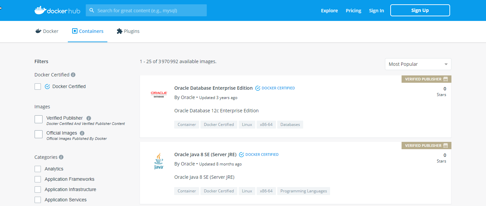
<cite>Source: [https://hub.docker.com](https://hub.docker.com) hosted repository service provided by Docker for finding and sharing container images</cite>

### Dockerfile

Let's create our first image using Dockerfile and run it - to do so, we will need to: 

- [ ] Prepare the Dockerfile
- [ ] Edit Dockerfile
- [ ] Build an Image
- [ ] Tests

---

#### Prepare the Dockerfile
To create the Docker image, we need a root directory where will be placed our Dockerfile:

1. create a new `docker_ubuntu` folder
2. create blank `Dockerfile` file inside `docker_ubuntu` directory - most of the time, Dockerfile can be found at the top level of the project or if you use docker-compose, in separate subdirectories related to each part of the application like php/mysql/nginx etc..

***Progress:***
- [x] Prepare the Dockerfile
- [ ] Edit Dockerfile
- [ ] Build an Image
- [ ] Tests

---

#### Edit Dockerfile
Our first template will be based on Ubuntu image pulled from Docker Official Images registry. 

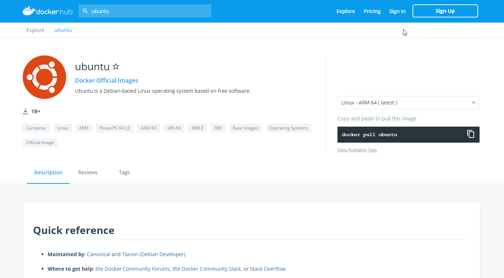
<cite>Source: [https://hub.docker.com](https://hub.docker.com) Ubuntu - Docker Official Image</cite>

Please open newly created Dockerfile and paste inside the following recipe instructions:

```
FROM ubuntu:latest
ENTRYPOINT ["/bin/echo"] 
```
<cite>Source: [Dockerfile](src/dockerfiles/Dockerfile_Ubuntu)</cite>


* FROM : base `ubuntu:<version>` image that our template relies on. Creating an image FROM another one will pull the baseimage locally. By default if no tag is precised (FROM php:< TAG >), latest version will be pulled from the registry. However latest not always points to the most-recent version of an image as this is a default tag! The best solution is always point explicitly to IMAGE:VERSION we want to use. Image repository name is composed of USER_NAME/IMAGE_NAME and if both are the same like 'php/php' we can skip the full description and use just the 'php'.

* ENTRYPOINT : allows to configure a container that will run as an executable

***Progress:***
- [x] Prepare the Dockerfile
- [x] Edit Dockerfile
- [ ] Build an Image
- [ ] Tests

---

#### Build an Image

We are almost there! Let's run now 'build' command (at the same level where Dockerfile is):

> `docker build -t docker_ubuntu .`

* `.` : references current directory
* --tag , -t : adds useful information about our image name/version helpful to use the image in later commands

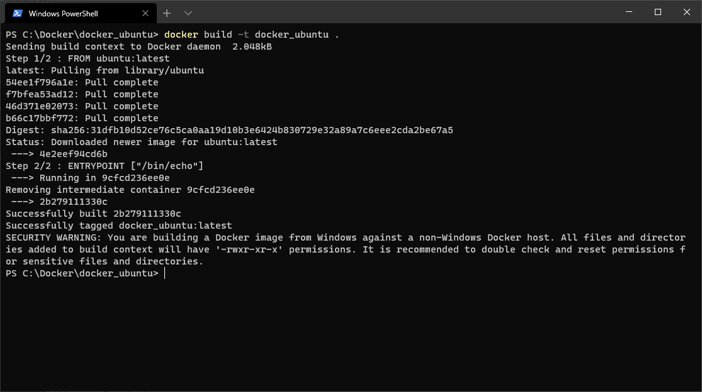

> *Command:*  
> `docker build [OPTIONS] PATH | URL | -`
>
> *For more information:*  
> `docker build --help`

Congratulations, your first template has been finalized and image build. 

> `docker images` : shows Docker images locally stored with the Docker Engine

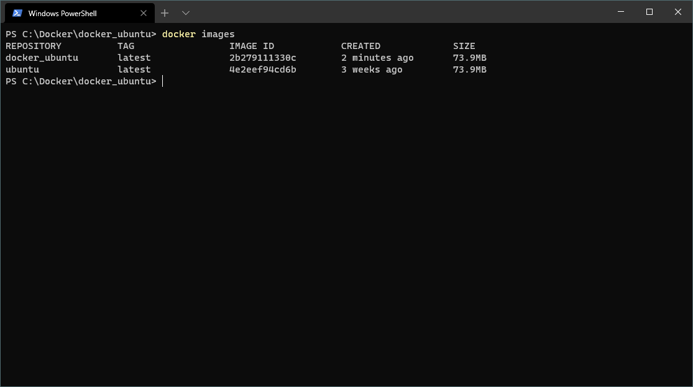

> *Command:*  
> `docker images [OPTIONS] [REPOSITORY[:TAG]]`
>
> *For more information:*  
> `docker build --help`

***Progress:***
- [x] Prepare the Dockerfile
- [x] Edit Dockerfile
- [x] Build an Image
- [ ] Tests

---

#### Tests

It is time to test the image - plese run the following command:

`docker run docker_ubuntu Well done!`

* docker_ubuntu : image name IMAGE_NAME
* 'Well done!' : is our argument passed to ENTRYPOINT
* EXITED (0) : everything went well and command finished with success

Awsome! You, have just created brand new container and printed out the string parameter passed to `run` command  (using '/bin/echo') same like 'hello-world' minimal Docker container (more about containers in next part of the document):


Here are the OPTIONS you can use frequently while running Docker containers:

- `--name` : assign a name to the container
- `--rm` : automatically remove the container when it exits
- `--tty, -t` : allocate a pseudo-TTY
- `--interactive, -i` : keep STDIN open even if not attached
- `--user, -u` : username or UID (format: <name|uid>[:<group|gid>])
- `--volume -v` :	bind mount a volume
- `--env, -e` : set environment variables
- `--entrypoint` : overwrite the default ENTRYPOINT of the image
- `--expose` : expose a port / range of ports. Att: Expose is justa a documentation to list the ports by default your application will be listening without publishing them to the host machine. Those ports will only be available to linked services inside same docker network.
- `--publish, -p` : publish a container’s port(s) to the host 

> *Command:*  
> `docker run [OPTIONS] IMAGE [COMMAND] [ARG...]`
>
> *For more information:*  
> `docker run --help`

In Docker Desktop Dashboard there is a new container entry ('kind_ride' in this example, but you will get different as the name is random). The random container name given by docker combines an adjective with the name of a famous person (if it was not defined while creating the object using --name="custom_name" [OPTIONS]).

As you can notice the container based on your image is stopped! Something is wrong then? No, not at all - as long as Exited code is 0, everything went as planned. 

After the command is finished, the container exits immediately as has nothing to do and knows there is no input coming. To keep the container alive a process needs to run, otherwise the container will stop.

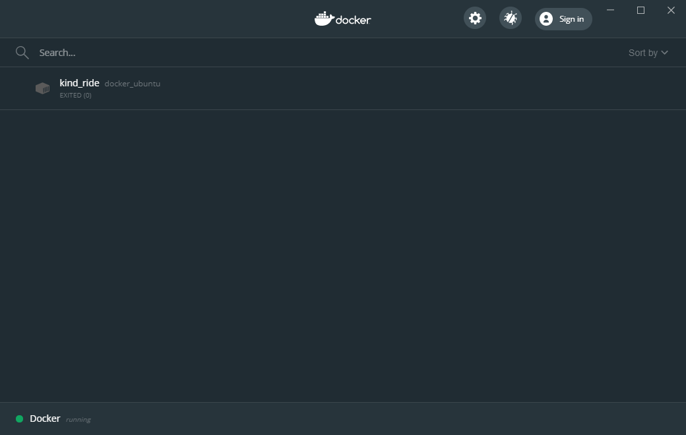

Att: Use `docker run` command with caution! Every time it executes, Docker creates and runs a new container of an image and this is probably not what you want (in 'Containers' section we discuss how to start/stop those objects).

***Progress:***
- [x] Prepare the Dockerfile
- [x] Edit Dockerfile
- [x] Build an Image
- [x] Tests

---

### Dockerfile - more

Let's create our second image using Dockerfile. Then we will try to update it (as images are stateless, we do not modify them directly, instead we use complementary layers that enrich the baseimage ecosystem). The same preparation list will serve us to accomplish the task:

- [ ] Prepare the Dockerfile
- [ ] Edit Dockerfile
- [ ] Build an Image
- [ ] Tests
- [ ] Delete the Image

---

#### Prepare the Dockerfile

1. create a new `docker_php` folder
2. create blank `Dockerfile` file inside `docker_php` directory

***Progress:***
- [x] Prepare the Dockerfile
- [ ] Edit Dockerfile
- [ ] Build an Image
- [ ] Tests
- [ ] Delete the Image

---

#### Edit Dockerfile

Ous second image will be based on php:7.4-apache image - Debian's Apache httpd in conjunction with PHP.

> *Command:*  
> `php:<version>-apache`
>
> *For more information:*  
> `https://hub.docker.com/_/php`

This image will 

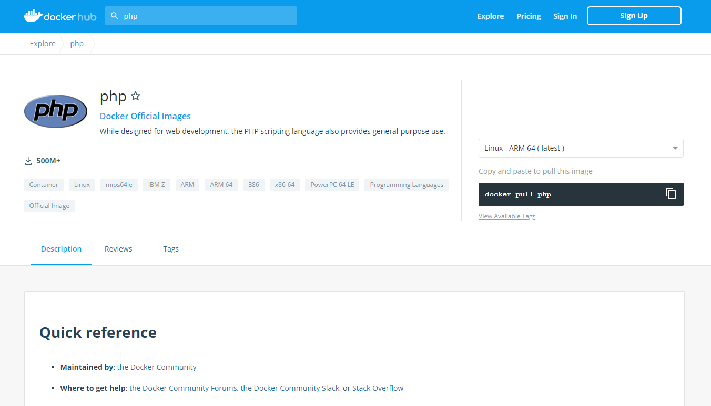
<cite>Source: [https://hub.docker.com](https://hub.docker.com) Ubuntu - Docker Official Image</cite>

Please open newly created Dockerfile and paste inside the following recipe instructions:

```
FROM php:7.4-apache
RUN apt-get update
CMD [ "php", "-v" ] 
```
<cite>Source: [Dockerfile](src/dockerfiles/Dockerfile_PHP)</cite>

* FROM : base `php:<version>-apache` image
* RUN : executes command in a new layer
* CMD : default command (with parameters) to run within the container

Each line in the Dockerfile will create a layer (set of changes) made to the filesystem. The php:7.4-apache base image is made of layers too - that will give us total of `php:7.4-apache layers + 2 ` (RUN..., CMD...). 

***Progress:***
- [x] Prepare the Dockerfile
- [x] Edit Dockerfile
- [ ] Build an Image
- [ ] Tests
- [ ] Delete the Image

---

#### Build an Image

> `docker docker build -t docker_php:1.0 .`

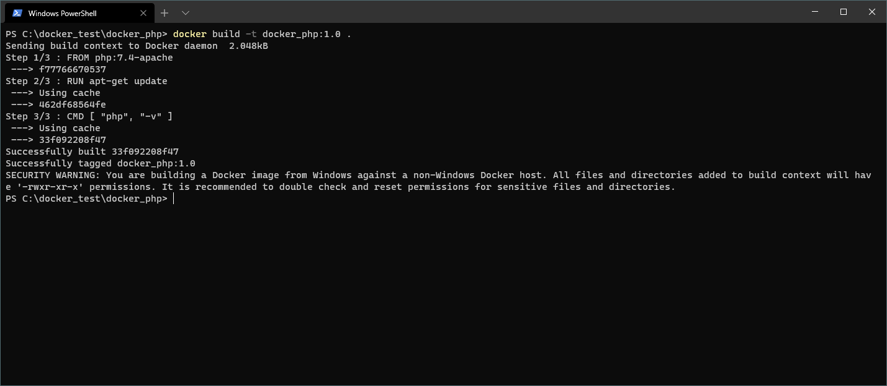

Each time Dockerfile changes, `docker build .` command should be run in order to take into account layer changes. The process is extremely fast as only the elements not yet run will be processed. However sometimes it can cause some unexpected issues and to avoid that you can disable the cache with `--no-cache` argument. 

To keep track of origin and show images that are layered into our image together with commands that were used to build it, plase run:

> `docker history docker_php:1.0`


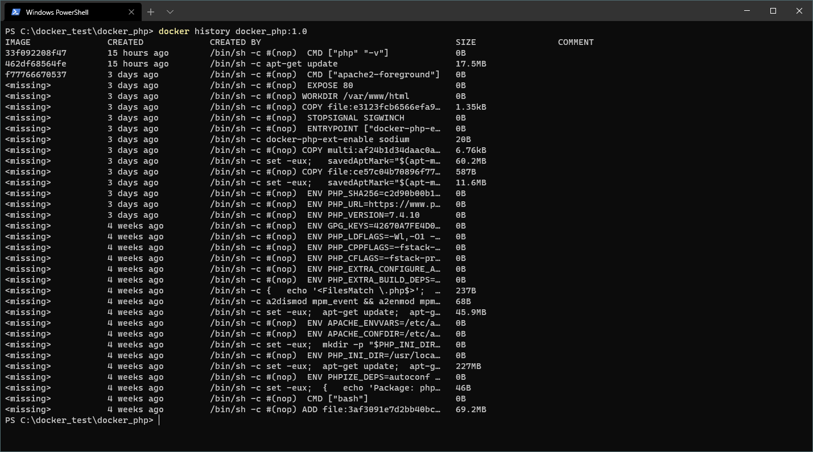

> *Command:*  
> `docker history [OPTIONS] IMAGE`
>
> *For more information:*  
> `docker history --help`


***Progress:***
- [x] Prepare the Dockerfile
- [x] Edit Dockerfile
- [x] Build an Image
- [ ] Tests
- [ ] Delete the Image

---

#### Tests

Run now the following command: `docker run docker_php:1.0` - as image is referenced by tag `docker_php:1.0`. 

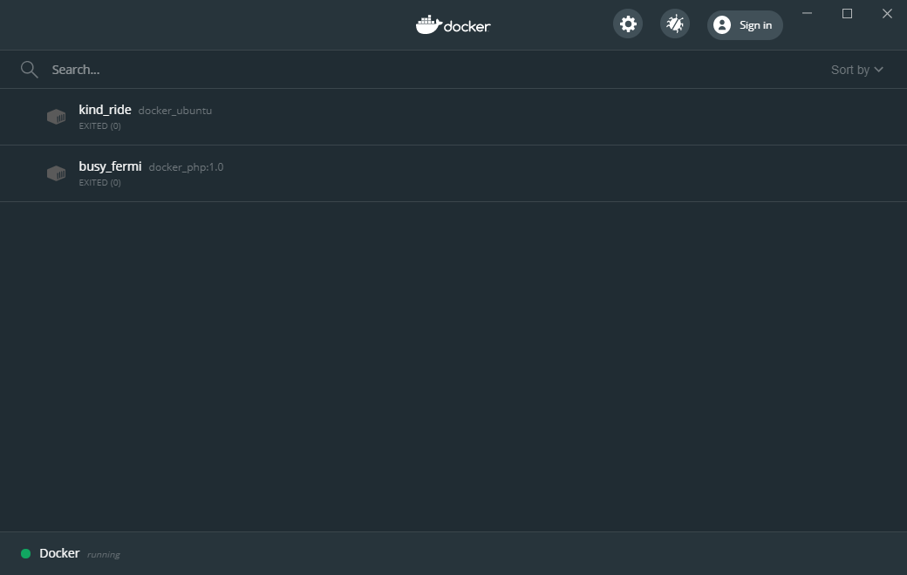

To ensure that all the packages were installed correctly, we crate a new container with Interactive mode (not pay attention at the moment what each line means as we will go through those details in next part of the document).

 > `docker run -it docker_php:1.0 sh` : creates new 'mystifying_yonath' container with interactive mode (keeps sontainer alive)

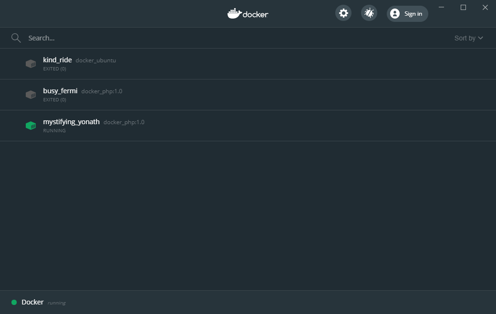

Please run the followng commands in terminal:

```
 * apache2ctl -V |grep -i "Server version" : show version apache
 * php -m : show installed php modules
 * exit : to stop running container
```
As soon as you exit the terminal, the container will stop running.

***Progress:***
- [x] Prepare the Dockerfile
- [x] Edit Dockerfile
- [x] Build an Image
- [x] Tests
- [ ] Delete the Image

---

#### Delete the Image

You should keep your local images list clean and up to date. Now, we will try to do so and remove Ubuntu image stored locally.

> `docker images` : shows Docker images locally stored with the Docker Engine

> *Command:*  
> `docker images [OPTIONS] [REPOSITORY[:TAG]]`
>
> *For more information:*  
> `https://docs.docker.com/engine/reference/commandline/images/`

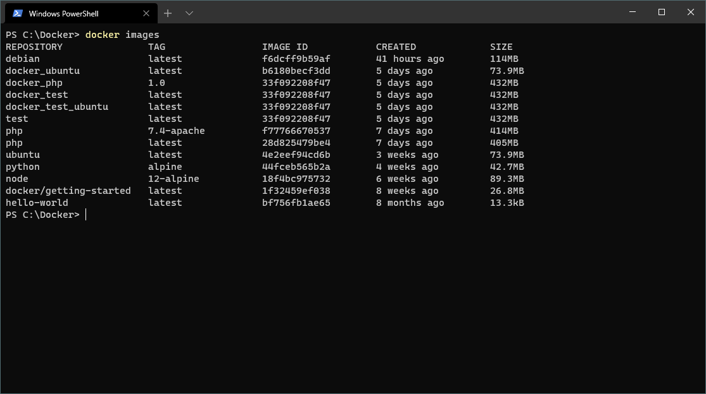

Each image has its unique IMAGE_ID, this information serves us to point the command directly to the right object to remove all associated filesystem layers:

> docker rmi 4e2eef94cd6b

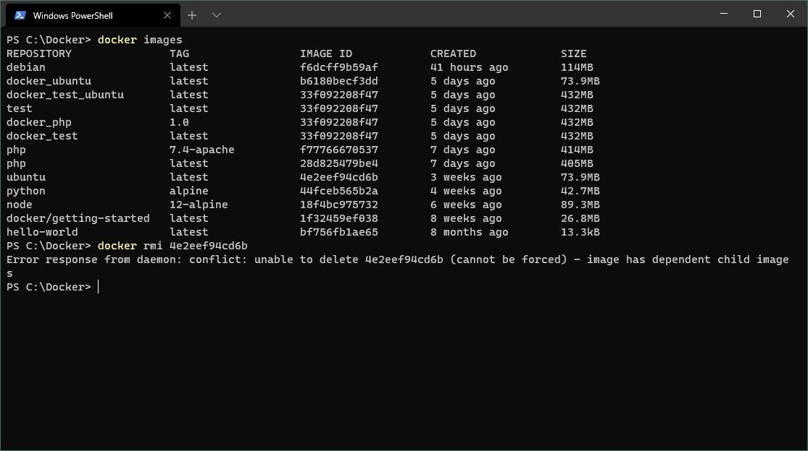

What is wrong? If you try to delete an image that other local image was based on, or there is a container related to the image, this will raise an error. You should delete related images and stop & delete all those container(s) first.

***Progress:***
- [x] Prepare the Dockerfile
- [x] Edit Dockerfile
- [x] Build an Image
- [x] Tests
- [x] Delete the Image

--- 

## Quiz

<details>
<summary>How to list all the images on the host node ?</summary>

> *Command:*  
> `docker images` : show all top level images   
> `docker image ls -a` : show all images
> 
> *Description:*  
> `docker image ls` : by default hides intermediate images
> 
> 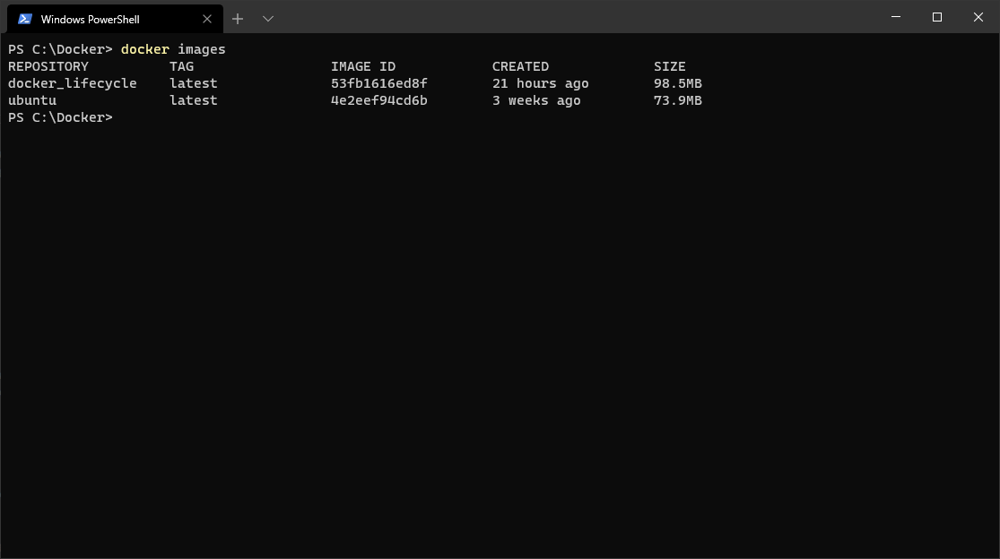
</details>

<details>
<summary>What is the command to get a Debian image from registry ?</summary>

> *Command:*  
> `docker pull debian`
> 
> *Description:*  
> Pull an image from a registry
> 
> 
</details>

<details>
<summary>What is the command to remove Debian image from the host node ?</summary>

> *Command:*  
> `docker rmi debian`
> 
> *Description:*  
> Remove image from the host node
> 
> 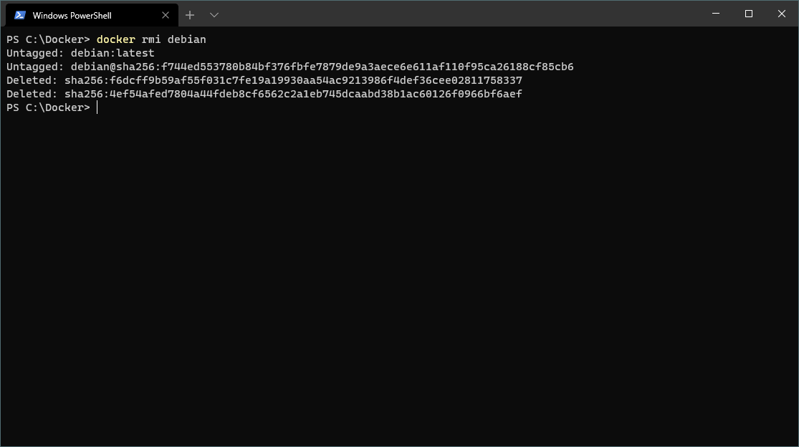
</details>

<details>
<summary>How to clean up unused images ?</summary>

> *Command:*  
> `docker image prune`  
>
> *Description:*  
> Clean up unused images
> 
> 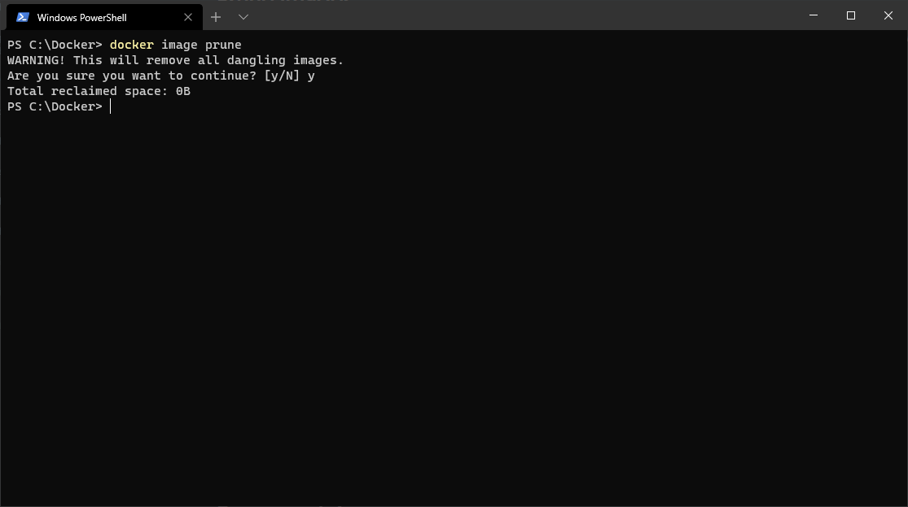
</details>

<details>
<summary>How to delete all the images on your Docker host ?</summary>

> *Command:*  
> `docker rmi -f $(docker images -a -q)`  
>
> *Description:*  
> delete all the images on your Docker hosts
> 
> 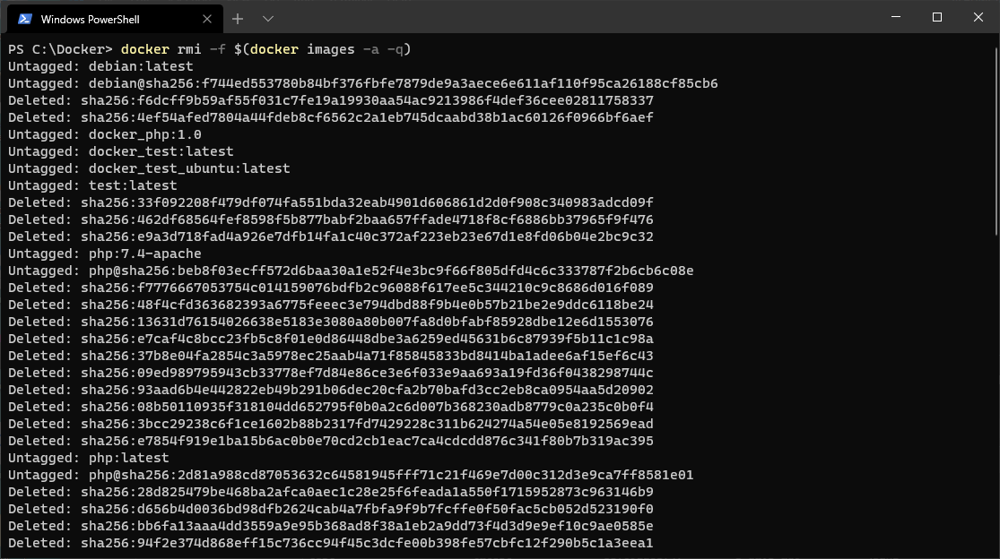

</details>
