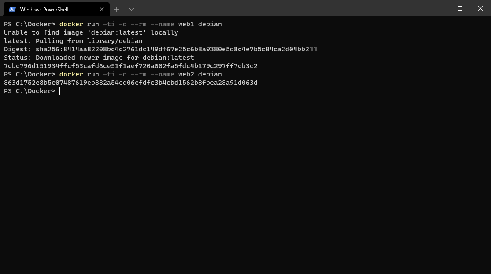
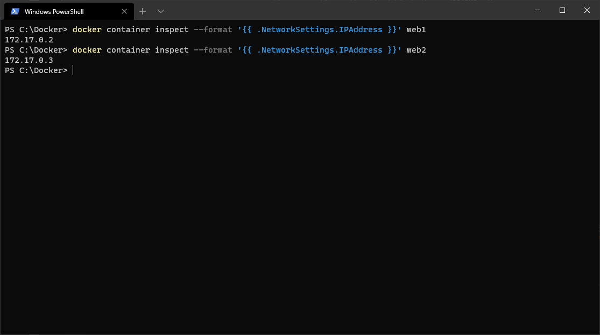
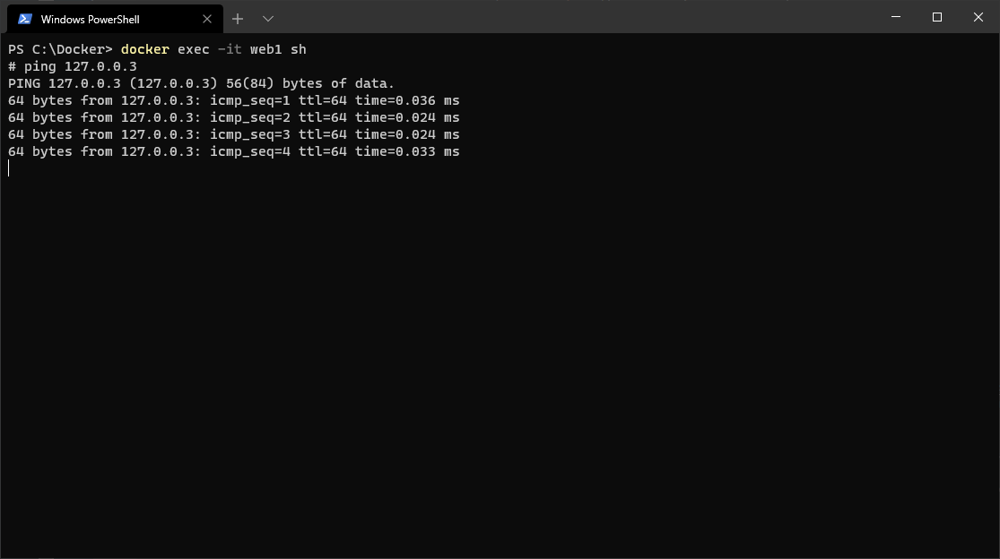
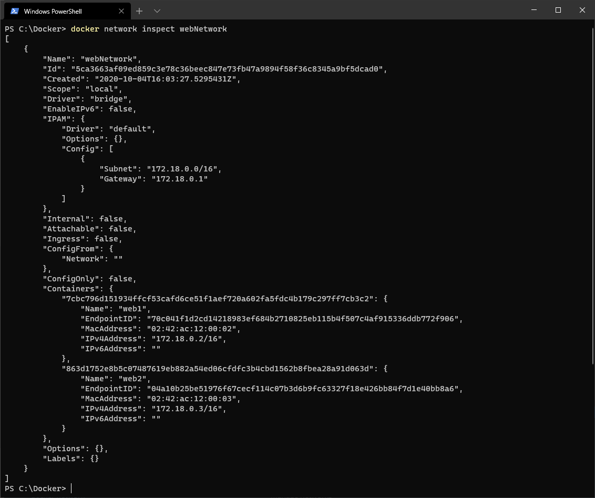
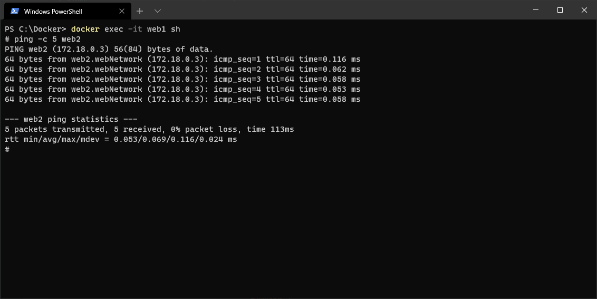

[< BACK ](../../overview/README.md)

## Networks

- [Bridge Network](#Bridge-Network)
- [Create containers](#Create-containers)
- [Test IP connection](#Test-IP-connection)
- [Create network](#Create-network)
- [Attach containers to network](#Attach-containers-to-network)
- [Test network connection](#Test-network-connection)


Docker containers can be connected together and exposed/or not to outside world. Below the different network strategies used by Docker:

- bridge : default network driver (used when --network option is not specified), private network that makes communication between multiple containers possible on the same Docker host.
- host : removes network isolation between the container and the Docker host and the container does not get its own IP-address unlike under bridge networking (Att: The host networking driver only works on Linux hosts, and is not supported on Docker Desktop for Mac, Docker Desktop for Windows, or Docker EE for Windows Server). 
- Overlay networks : virtual networks build on the top of an existing physical network, solution for containers running on different Docker hosts to communicate (unlike in bridge networking where container have no communication with outside world without exposing it's ports)
- Macvlan networks : containers gets a unique MAC address and becomes a part of Docker host network, used when moving from a VM infrastructure
- none : disable all networking


### Bridge Network

Inside Bridge Network each container gets its own IP-address that is single way of exchange between those objects on same host and the default bridge network, unless you precise the --link option (however as per official Docker documentation, it's recommended to use user-defined networks to facilitate exchange between two containers instead of using --link option.

> *Command:*  
> `docker network inspect bridge`
>
> *For more information:*  
> `docker network --help`


***Progress:***
- [ ] Create containers
- [ ] Test IP connection
- [ ] Create network
- [ ] Attach containers to network
- [ ] Test network connection 

---

#### Create containers

To test the connection between two containers on Bridge network, let's create two containers:

```sh
$ docker run -ti -d --rm --name web1 debian
$ docker run -ti -d --rm --name web2 debian
```



Retrieve useful information from Bridge Network:

```sh
$ docker network inspect bridge
```

or using direct command:

```sh
$ docker container inspect --format '{{ .NetworkSettings.IPAddress }}' web1
$ docker container inspect --format '{{ .NetworkSettings.IPAddress }}' web2
```




***Progress:***
- [x] Create containers
- [ ] Test IP connection
- [ ] Create network
- [ ] Attach containers to network
- [ ] Test network connection 

---

#### Test IP connection

Execute running container web1 to ping web2:
Att: Please use 'web2_IP' address to reach the endpoint as two containers shared Bridge network by default are reachable this way (new IP is assigned when container is created, please use it with caution cause next time you will run the process your previous IP list will be outdated).

```sh
$ docker exec -it web1 sh
$ ping -c 5 web2_IP
```



***Progress:***
- [x] Create containers
- [x] Test IP connection
- [ ] Create network
- [ ] Attach containers to network
- [ ] Test network connection 

---

#### Create network
Another option is to create a custom Network - you w'ont have to use IP addresses that are assigned dynamically on each container run and will be able to use Network label instead. This is because user-defined bridges provide automatic DNS resolution between containers.

Create your Network webNetwork:

```sh
$ docker network create webNetwork
```

***Progress:***
- [x] Create containers
- [x] Test IP connection
- [x] Create network
- [ ] Attach containers to network
- [ ] Test network connection 

---

#### Attach containers to network

Attach both web1 & web12 containers to that network

```sh
$ docker network connect webNetwork web1 
$ docker network connect webNetwork web2
```

Display information about new network:

```sh
$ docker network inspect webNetwork
```



***Progress:***
- [x] Create containers
- [x] Test IP connection
- [x] Create network
- [x] Attach containers to network
- [ ] Test network connection 

---

#### Test network connection

Ping Web2 from Web1 using container name from same Network:

```sh
$ docker exec -it web1 sh
$ ping -c 5 web2
```



***Progress:***
- [x] Create containers
- [x] Test IP connection
- [x] Create network
- [x] Attach containers to network
- [x] Test network connection 

---

### Other 

> *Command:*  
> docker network disconnect bridge container_name
>
> *Description:*  
> Disconnect a container from a network


> *Command:*  
> docker network rm network_name
>
> *Description:*  
> Removes network


