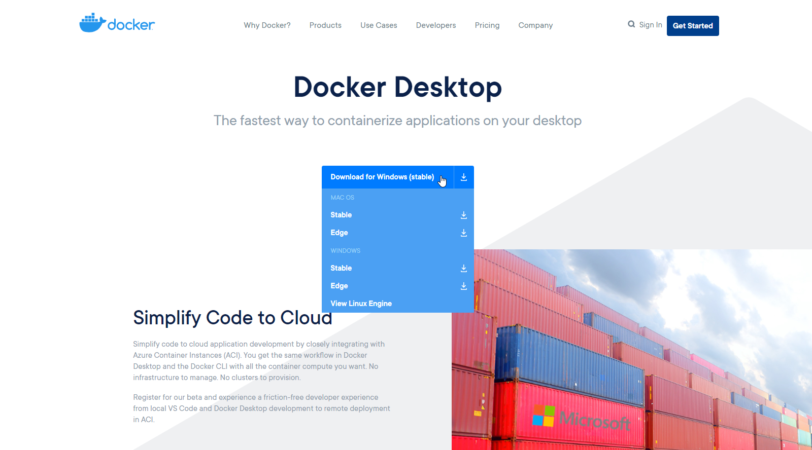
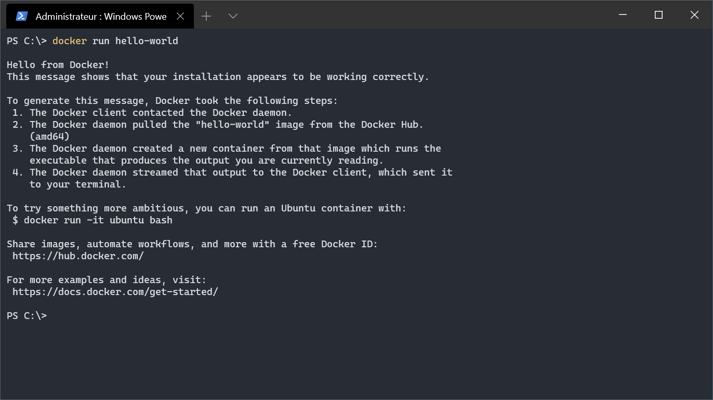
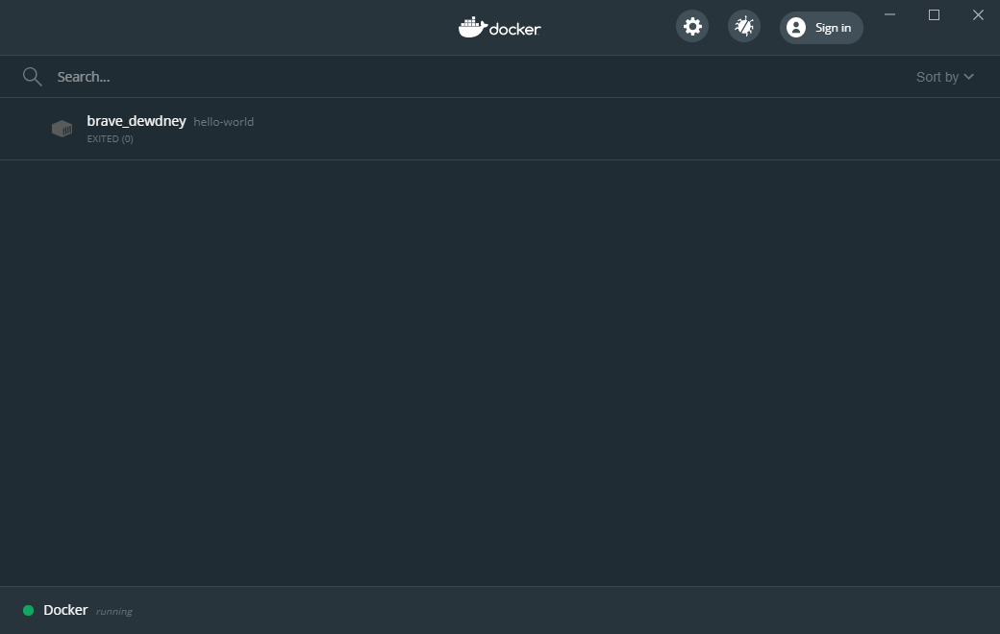
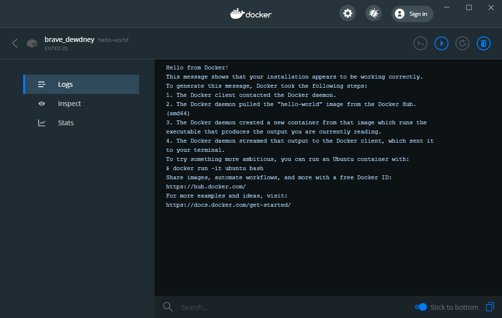
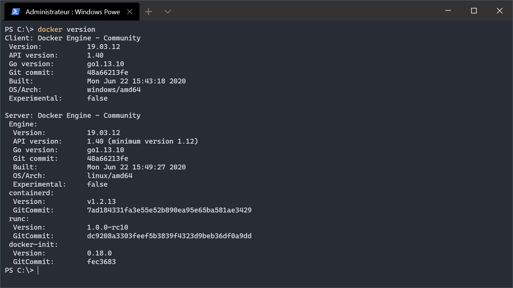
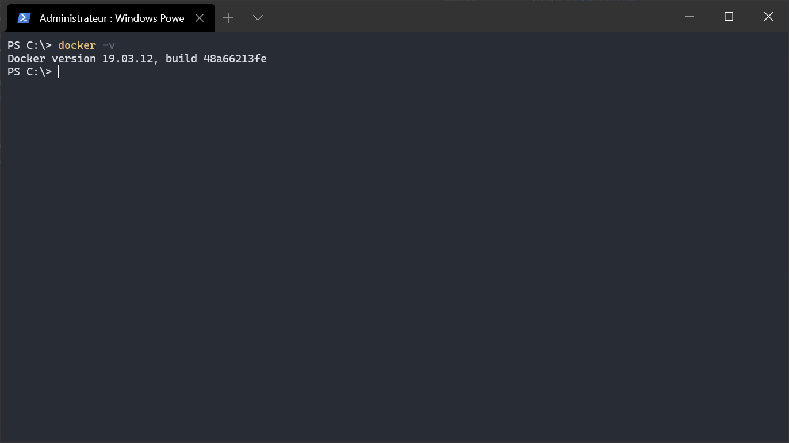
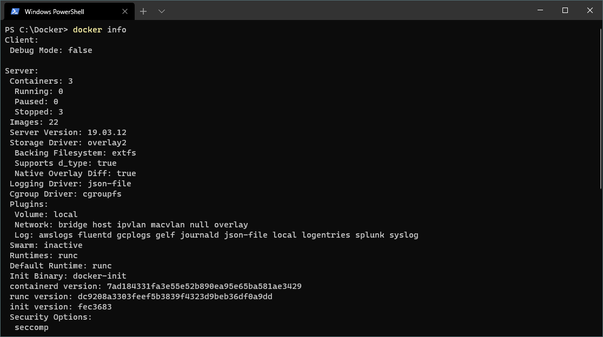

[< BACK ](../../README.md)

# Overview

Docker is an open source project based on technology that allows creation and management of Linux containers as packages. Different local, test and production envoronments makes difficult shipping the application and can cause some unexpected issues. Docker helps to solve that problem running each app component in different containers with its own ecosystem dependencies on the same host. All you need, is to build the configuration once and ship to all developpers, independantly of their operating system - the image is guaratneed to run the same way.

Refering to the official documentation:

> Docker is an open platform for developing, shipping, and running applications. Docker enables you to separate your applications from your infrastructure so you can deliver software quickly. 
> <cite>[docker.docs.com](https://docs.docker.com/)</cite>

- containers are faster to start 
- containers take less space
- containers isolate applications while VMs isolates entire systems
- containers share the host OS and VMs run in their own OS
- containers are possibly less secure due to process-level isolation

Boths have their pros and cons. Probably containers are right solution if you want to decrease the number of servers running bunch of applications, be able to smoothly change the settings or deploy development environment in a second. VMs seems to be good option if the system needs to be isolated or full OS resources allocated to an application etc.

## Docker Desktop

You can download and install Docker on multiple platforms like Windows, Mac or Linux.

> In order to get the Docker, 
[https://docs.docker.com/get-docker/](https://docs.docker.com/get-docker/)

  

<cite>Source: [https://www.docker.com/products/docker-desktop](https://www.docker.com/products/docker-desktop)</cite>

  

The Docker Desktop installation includes client-server application that creates and manages Docker objects, Docker CLI running as a command tool and other elements (we won't discover them all in this document). The Docker Engine API is a RESTful API that communicates with Docker deamon (dockerd running in the background and manages objects such as images, containers, volumes or networks) to create and run containers based on an image.
Docker images are required while creating new containers and stored in Docker registry that can be public (Docker Hub) or private. Docker looks for images on Docker Hub by default.

<cite>Source: [docker.docs.com](docker.docs.com)</cite>
 
  
 
## First command

Let's try to enter our first Docker command. The ideal example for this would be running 'hello-world' image. 

> `docker run hello-world`

What just happened? Docker client sent the message to Docker deamon requesting hello-world image to be run. Deamon checked if image exists locally and if it was not the case, pulled it from Docker Hub official registry. Container based on retrieved image was created, content showed in console, finally container exited with code (0) - letting you know that everything went well. 

The Log comes from `hello.c` binaryfile included in the image and executed at the end of the process with `CMD`.

[https://github.com/docker-library/hello-world](https://github.com/docker-library/hello-world)

 
The Docker Desktop Dashboard enables you to interact with created container - stop/start it, read the logs/output or simply remove it.
  

 
## Commands

> *Command:*  
> `docker version`
> 
> *Description:*  
> Show the Docker version information
> 
> 

> *Command:*  
> `docker -v`
> 
> *Description:*  
> Show the Docker version information (short version)
> 
> 

> *Command:*  
> `docker info [OPTIONS]`
> 
> *Description:*  
> Show information regarding the Docker installation
> 
> 
